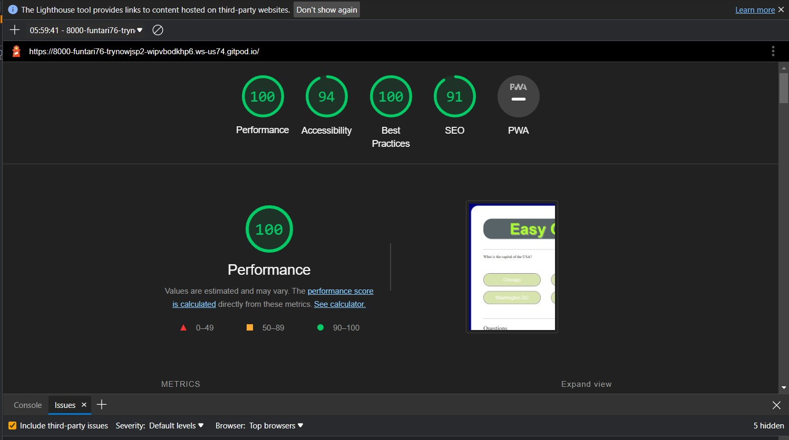

#
#  Easy Quizzy

## PURPOSE

Easy Quizzy is a easy quiz that is ment as a 'refresher' of general information that is easy to recall.
* Here is a link to the [final project]

## CONTENTS

#
# UX/UI

## USER STORIES

* As a user, I want to easily understand the main purpose of the quiz
* As a user, I want the quiz to be colorful 
* As a user, I want to be able 
* As a user, I want to 

## WIREFRAMES

## FEATURES

* The quiz consists of:

* Layout and content:
    * The layout is simple and stays centered across all screen widths
    * The text and heading are top and bottom to keep the main game area in the centre

* Color Scheme:
    * For the quiz I chose light and bright colours to keep it appealing to the eye
    * The color scheme chosen was light yellow and blue, With dark grey text rgb(32, 30, 30)
    * The background image will be light blue in the shape of a clock rgb(63,72,204)
    * The background colour is light yellow rgb(221,185,86)
    * The button colours 

## Validation

## Lighthouse

## Accessibility

#
# TECHNOLOGIES:

## DEVELOPMENT

* The project was written and tested using [Gitpod](https://gitpod.io/)
* The project uses [Github](https://github.com/) for utilising git version control
* The project was debugged using [Google Chrome Development tools](https://developer.chrome.com/docs/devtools/)
* The project was tested for responsiveness at different screen sizes using [Am-I-Responsive](http://ami.responsivedesign.is/#)  

## DESIGN

* The project's wireframes were designed in [Balsamiq](https://balsamiq.com/wireframes/)
* The project utilised [favicon.io](https://favicon.io/favicon-converter/) to create the Favicon to the appropriate format
* The background image was compressed using [TinyPNG](https://tinypng.com/)

## LANGUAGES USED

* The project was written using [HTML5](https://en.wikipedia.org/wiki/HTML5) for the basic structure
* The project was written using [CSS3](https://en.wikipedia.org/wiki/CSS#CSS_3) for styling
* the project was written using [JAVASCRIPT ES6](https://en.wikipedia.org/wiki/JavaScript) for HTML manipulation

#
# DEPLOYMENT
## REMOTE DEPLOYMENT: